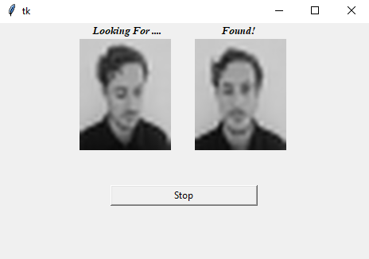

# Facial-Recognition

Facial Recognition Software for Computer Vision (CITS4402)

This program aims to automatically process and downsample images to recognize and classify faces within a given face dataset. Each class contains 10 instances which will be partitioned according to the split specified (i.e. 70% used for training and 30% used for testing) The Linear Regression Classifcation (LRC) algorithm was utilised to train the model which works by computing the minimum distance between two given images. We provide accurate prediction for the face recognition by finding lowest distance between the different class images.

### Authors - Group 33

Benjamin Podmore (22504617)

Chintan Shah (22497366)

Ahbar Sakib (22512321)

### Version

v1.19.05.2021

### Directory Contents
	a. FaceDataset1 - original dataset which contains images from 40 different classes

    b. FaceDataset2 - new dataset which contains new images (5 different classes) and is mixed with 7 classes from the original dataset

	b. gui.py - python file to run the GUI for the original dataset (FaceDataset1)

    d. gui_new_faces.py - python file to run the GUI for the new faces dataset (FaceDataset2)
	
    e. models.py - python file that is used by the GUI to perform computatons using the LRC algorithm
        i.  it also displays some evaluation results such as the accuracy and standard deviation

	f. README.md - summarizes of how to run the program and discusses the different train/test split evaluations

### Using the software

#### Downloading Dependencies

To get started, make sure that you have the all the necessary files and folders listed in Directory Contents are downloaded. We also have to ensure that python is installed on the system.

We have to download these packages either using `conda` or we have to use `pip`. The external packages that needs to be downloaded includes:

1.  scikit-image
2.  numpy
3.  tkinter
4.  matplotlib
5.  pillow

If you are using a conda virtual environment, you can install these packages using:

`conda install <package_name>`

On the other if you are using a python terminal or the command line in a Linux/UNIX operating system, you can download these packages using pip:

`pip install <package_name>`

#### Running the program

To run the programs, we have to use either of the following commands in the command line or the virtual enviroment terminal depending which dataset we are testing:

`python gui.py` - Running FaceDataset1

`python gui_new_faces.py` - Running FaceDataset2

#### Application Interface

When we have run the program, we should be able to see the GUI pop up and should look similar to the follwoing image:

The left image shows what image we are testing while the right image displays a matching similar image. This show that the face has been correctly detected and classfied.

The stop button will close the GUI application and end the face recognition sequence.

### Procedure and Results

Each of these split consists 5 validations across each class in the dataset and the accuracy has been averaged. The following table below displays the testing split percentage (left column), the average accuracy (middle column) and the stand deviation of the predictions.

| Split	| Average Accuracy | Std Deviation |
| :---: | :--------------: | :-----------: |
|  50%  |      0.952       |    0.00812    |
|  40%  |      0.9713      |    0.00935    |
|  30%  |      0.9817      |    0.006236   |
|  20%  |      0.985       |    0.014577   |

### Evaluation

#### Image Data Partioning:

The dataset requires a higher partioning/split for the training phase due to the lack of instances in the entire dataset. Since there are a total of 400 instances, it is better to use a 70/30 split (70% for training and 30% testing) and can be evaluated to be the optimal partioning. The standard deviation decreases continuously but increases after the 30% split. We believe that this is the optimal conditions for training the model.

There is also a risk of overfitting the data which is caused by using a very high percetage of the dataset for the training phase. We believe that the standard deviation increases again after the 30% split due to this issue.
